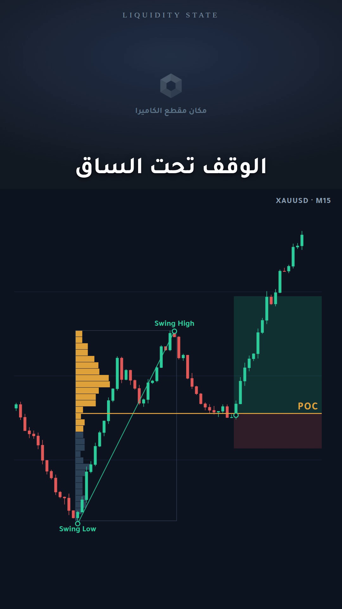

# Split-Screen Reel — ريل الشاشة المقسومة

The second adopted format: **talking head on top, live chart below, karaoke captions at the seam.**
Where `MARKUP.md` covers a chart that explains itself slowly, this format is a chart that *argues*
while a voice carries the pace.

**Template:** `reel-split-demo.html` → **`reel-split.mp4`** · **Theme:** `data-ls-theme="terminal"`
· **Engine:** `markup.js` + `captions.js`



---

## Layout — 1080×1920

| Band | Extent | Contents |
|---|---|---|
| Face panel | top **31%** (0 → 595px) | camera footage, `object-fit: cover` |
| Caption | straddles the seam, baseline just above it | 1–4 words, white, 76px, weight 800 |
| Chart panel | **31% → 100%** (595 → 1920px) | dark terminal chart, 24px side padding |
| Brand bar | y ≈ 34px | `LIQUIDITY STATE`, wide-tracked, low contrast |
| Ticker | just under the seam, right | `XAUUSD · M15` |
| CTA | y ≈ 1770px, fades in on the last 2.6s | `احفظ البوست 🔖` |

Measured from the reference: the seam sits at 30.6% of frame height, and the caption baseline rides
just above it — the caption belongs to the face panel, not the chart.

---

## The two clocks

This is the whole idea of the format. **The caption carries the rhythm, the chart carries the
argument, and they run at different speeds.**

| Clock | Measured | Adopted |
|---|---|---|
| Caption group | median hold **0.60s** (range 0.3–1.1) · 33 cues in 20s | `LSCaptions.HOLD = 0.6` |
| Chart beat | median **3.5s** between state changes · 6 in 20s | one `at:` beat per ~3.5s |
| Ratio | ~**6 captions per chart beat** | keep it near 6 |

Consequences worth stating plainly:

1. **Never sync a chart change to every caption.** The chart moving at speech pace is what makes
   amateur edits feel frantic. It holds still while 5–6 captions go by, then does one thing.
2. **The chart beat lands on the caption that names it.** The profile appears on
   "<em>Volume Profile</em>", the POC rail extends on "<em>POC</em>" — not a beat early, not late.
3. **Captions never wait for the chart.** They keep the floor moving during the holds.

---

## Captions

- **1–4 words per cue.** One breath, one idea. If a cue needs 5 words it is two cues.
- **White, weight 800, 76px**, centred, with a soft dark shadow so it survives any footage behind it.
- **Gold `#E0A33C` on exactly one token per cue, and only sometimes** — a number, a level name, the
  term the sentence is about. Wrap it in `<em>`. Two gold words in one cue means neither is emphasis.
- **Arabic body, English technical terms** — `POC`, `Volume Profile`, `OB`, `FVG` stay Latin inside
  the Kuwaiti line. The browser shapes and orders this correctly; never pre-reshape (see the
  `arabic-video-text` skill).

```js
const caps = LSCaptions({
  mount: '.ls-reel',
  track: LSCaptions.pace([
    ['من القاع', 0.7], ['إلى القمة', 0.8],
    ['<em>Volume Profile</em>', 1.0], ['هذي هي', 0.6], ['<em>POC</em>', 0.9]
  ], { start: 0.6 })
});
```

---

## Chart — terminal theme

`data-ls-theme="terminal"` swaps the palette to the dark panel used in this format:

| Token | Value | Role |
|---|---|---|
| `--ls-bg` | `#0E1420` | panel background |
| `--ls-bullish` / `--ls-bearish` | `#2ECC9A` / `#E15A5A` | candles |
| `--ls-vp-bar` | `#2E4258` | volume profile, outside the value area |
| `--ls-vp-va` | `#E0A33C` | value area — the only bright thing on the chart |
| `--ls-poc` | `#E0A33C` | point of control rail + entry line |
| `--ls-gridline` | `#1B2942` | grid |

The reference used silver/gold candles and a red POC. Red is reserved for invalidation in this brand,
so the POC and value area carry gold instead — same hierarchy, brand-consistent semantics.

Markup type scales up inside `.ls-reel` (labels 30px, swing tags 26px, POC 34px, strokes 2.2px):
a carousel is read at desk distance, a reel at arm's length on a phone.

---

## The entry model this format teaches

The reference reel is one idea end to end, and the format suits that:

```
1. mark the leg            structure()      swing low → swing high
2. drag the profile        volumeProfile()  fixed range across that leg
3. read the POC            poc()            extend it right — that is the level
4. wait for the tap        (a beat of nothing)
5. take the position       position()       entry at POC, stop under the leg, target above
```

New primitives for this:

| Call | Draws |
|---|---|
| `volumeProfile({from, to, bins, widthPct, valueArea})` | fixed-range histogram + range box; value area highlighted; returns `pocPrice` |
| `poc({price, from, label})` | the control rail, extended right, label at its right end |
| `position({from, entry, stop, target})` | target box above entry, stop box below, dashed entry line |

`volumeProfile` approximates per-bin volume from time-at-price when no `volumes` array is passed —
fine for schematic teaching charts, but pass real volume for a صفقة موثقة.

---

## Producing one

1. Shoot the face footage 9:16; only the top 31% is used, so frame for the upper third.
2. Drop it into `.ls-reel-face` as `<video>` or `` — it covers the slot.
3. Write the caption track from the actual voiceover, then set the chart beats with `at:` so each
   lands on its naming caption.
4. Render:

```bash
python3 assets/brand/capture-motion.py assets/brand/reel-split-demo.html out.mp4 30 1080 1920
```

5. Mux the voiceover in and master to **−14 LUFS** (see the `arabic-voiceover` skill).

The demo ships with a placeholder in the face slot — it is the one thing the template cannot
generate for you.
