# Liquidity State — Brand Identity Assets

Canonical brand identity for **@liquidity.state**: logo, approved color palette, typography,
and ready-to-use design tokens.

> **Standing rules live in [`../../CLAUDE.md`](../../CLAUDE.md)** — read it first. The one that
> governs every analysis: **three or four schools, always**, and they must agree on the *same
> price*, not merely appear side by side.

```
assets/brand/
├── colors.json            ← design tokens (source of truth for color + type)
├── brand.css              ← CSS variables + slide/chart/markup primitives
├── MARKUP.md              ← the approved chart markup method (read before marking up a chart)
├── markup.js              ← markup engine: levels, zones, structure, fib, projection + motion
├── markup-demo.html/.png  ← worked example of the full markup vocabulary
├── markup-motion.html/.mp4 ← the same markup drawn at the approved rhythm
├── FORMAT-REEL-SPLIT.md   ← split-screen reel format (face + chart + karaoke captions)
├── reel-split-demo.html/.mp4 ← the split-screen reel template
├── FORMAT-CAROUSEL.md     ← carousel page architecture + the footprint method
├── FORMAT-REEL-VERTICAL.md ← the vertical reel design method (.ls-vr) — read before building one
├── FORMAT-REEL-MTF.md     ← the two-frame (M15 → M5) reel method — read with the above
├── timeframe.js           ← M5 → M15 aggregation, and the check that proves they agree
├── footprint.js           ← footprint ladders: ladder / heat / inside / bars
├── carousel-demo.html     ← the 7-page carousel template — copy it, swap the content
├── carousel/              ← its render, 7 × 1080×1350
├── capture-slides.py      ← renders each page to PNG; fails if a drawing broke a rule
├── captions.js            ← karaoke caption track (0.6s cadence)
├── tools/check-rules-parity.js ← proves the JS and Python drawing rules agree
├── capture-motion.py      ← frame-accurate CDP renderer (motion page → MP4)
├── palette-swatches.html  ← swatch sheet source
├── palette-swatches.png   ← swatch sheet render (1080×1350)
├── fonts/                 ← vendored Tajawal (OFL) for reproducible renders
└── logo/                  ← logo lockups + gem mark (SVG + PNG)
```

---

## 1. Logo

| File | Use |
|---|---|
| `logo/liquidity-state-logo-light.svg` / `.png` | Primary lockup on light / cream backgrounds |
| `logo/liquidity-state-logo-dark.svg` / `.png` | Primary lockup on the dark-teal background |
| `logo/liquidity-state-mark.svg` / `.png` | Gem mark only, transparent — watermark, profile icon, favicon |

SVGs are the source of truth. PNGs are exported at 2400 px wide (mark at 1200 px).

**Mark:** faceted silver / steel gem. Keep it small — bottom-corner or top-corner watermark, never dominating.
**Clear space:** at least the height of the gem on all sides. **Minimum mark size:** 40 px.
Do not recolor the gem, stretch the lockup, or place the light lockup on busy / low-contrast photos.

---

## 2. Approved palette — light (cream) theme

This is the **approved primary design theme**, taken from the carousel design system
(slide "الإشارة التي تعاكسك"). Use it for carousels, charts and static posts.

| Role | Hex | Usage |
|---|---|---|
| Background — base | `#F2EDE4` | Slide canvas (warm cream) |
| Background — gradient start | `#F5F0E7` | Top-left of canvas gradient |
| Background — gradient end | `#EDE6DA` | Bottom-right of canvas gradient |
| Surface | `#E9F2F6` | Badge / callout box fill |
| Surface border | `#9EC4D5` | Badge / callout box + counter border |
| Text primary | `#15222E` | Headlines, sub-headlines, key stat lines |
| Text secondary | `#8FA0A9` | Body and closing explanation lines |
| Text accent | `#2C7F9E` | Highlight sentence, section labels |
| Watermark | `#8FA3AC` | Corner `LIQUIDITY STATE` wordmark |
| Candle — bullish | `#34809B` | Up candle body + wick (teal) |
| Candle — bearish | `#15222E` | Down candle body + wick (deep navy) |
| Structure | `#15222E` | Level lines, equal-lows, markers, circles |
| Gridline | `#DFD8CC` | Horizontal chart grid |
| Invalidation | `#DC4B41` | Stop / rejection mark (✗) — **reserved, never decorative** |

### Alternate — dark theme (reels / video overlays)

Background `#0E1E24`→`#12262E`, surface `#1B3A45`, text `#FFFFFF` / `#9FB4BC`,
bullish `#2ECC9A`, bearish `#E15A5A`. Activate with `data-ls-theme="dark"`.

### Metallic (logo mark only)

Silver/steel gradient: `#FFFFFF` → `#E6ECEF` → `#CDD6DA` → `#A9B4BA` → `#7E8A90`, edges `#BFC9CE`.


---

## 3. Typography

- **Arabic — Tajawal** (vendored in `fonts/`, OFL licensed).
  Bold 700 for headlines / sub-headlines / accent lines, Medium 500 for body, Regular 400 for captions.
- **Latin wordmark — Cormorant Garamond** (fallback Trajan Pro / Times New Roman), uppercase,
  letter-spacing `0.28em`. Used for the logo and the corner watermark. Italic for slide counters (`2/3`).
- **Technical terms & numbers** — Tajawal, Western digits (`XAUUSD`, `2.6R`, `Order Flow`, `FVG`, `POC`).

Type scale at a 1080×1350 canvas: headline 64 / sub-headline 40 / accent 34 / body 30 / caption 24 / watermark 22.

> **Arabic rendering:** always apply the `arabic-video-text` skill before rasterizing Arabic.
> Browsers and libass shape correctly from raw text; PIL, node-canvas and ffmpeg `drawtext` need
> reshaping + bidi first. The swatch sheet is rendered through Chromium for this reason.

---

## 4. Using the tokens

```html
<link rel="stylesheet" href="assets/brand/brand.css">

<div class="ls-slide">                     <!-- 1080×1350, cream gradient, RTL, Tajawal -->
  <div class="ls-badge">مثال تخطيطي</div>
  <h1 class="ls-headline">الإشارة التي تعاكسك</h1>
  <p class="ls-accent">هني الإشارة اللي تعاكسك — ولذلك رفضتها</p>
  <p class="ls-body">الفتيل تحت القاع يسحب السيولة، والإغلاق فوقه يلغي الكسر.</p>
</div>
```

Chart primitives: `.ls-candle-up`, `.ls-candle-down`, `.ls-level`, `.ls-grid`, `.ls-invalid`.
UI primitives: `.ls-badge`, `.ls-counter`, `.ls-pager` (`i.on` = active), `.ls-watermark`.

Render a slide to PNG:

```bash
/opt/pw-browsers/chromium-1194/chrome-linux/chrome --headless --no-sandbox --disable-gpu \
  --hide-scrollbars --allow-file-access-from-files --window-size=1080,1350 \
  --screenshot=out.png "file://$PWD/slide.html"
```

---

## 5. Chart markup

Structure lines, order blocks and explanation lines follow one approved method — hairlines with
labels set inside a break in the line, outlined zones, a single structure zigzag with swing tags,
and diagonals labelled along their own angle.

Markup is also **drawn, not pasted** — the pace is part of the method: a stroke lands, the chart
rests ~0.9s, then the label fades in. `MARKUP.md` §Rhythm carries the measured cadence.

Pass `autoTerminate: true` and every level and box ends itself at the candle that broke it; the
`chart-drawing-accuracy` skill checks the same rules standalone.

**Read `MARKUP.md` before marking up any chart.** Engine: `markup.js`. Worked examples:
`markup-demo.html` → `markup-demo.png` (static), `markup-motion.html` → `markup-motion.mp4` (animated).


---

## 6. Reel formats

**Default for any new reel: the vertical `.ls-vr` format.** Its design method — the vertical
bands, the one-clock rule, holds and the `atBar: N+1` correction, self-proving tiles, the
withheld result, the scrim, the measured loop seam, and the pre-delivery checklist — is written
up in **[`FORMAT-REEL-VERTICAL.md`](FORMAT-REEL-VERTICAL.md)**. `reel-confluence.html` is the
reference build.

| Format | Spec | Template |
|---|---|---|
| Static markup slide / slow-draw reel | `MARKUP.md` | `markup-demo.html`, `markup-motion.html` |
| Split-screen: face + chart + captions | `FORMAT-REEL-SPLIT.md` | `reel-split-demo.html` |
| Full-frame chart + footprint (faceless) | `reel-footprint.md` | `reel-footprint.html` |
| Documented trade, sweep → target | `reel-trade.md` | `reel-trade.html` |
| Range + volume profile, value-edge entry | `reel-value.md` | `reel-value.html` |
| Trend continuation from an order block (cream) | `reel-orderblock.md` | `reel-orderblock.html` |
| The entry as an eight-condition gate (cream) | `reel-entry-gate.md` | `reel-entry-gate.html` |
| Four-school confluence gate (cream) | `reel-confluence.md` | `reel-confluence.html` |
| Order flow joins the other three (cream) | `reel-orderflow.md` | `reel-orderflow.html` |
| The schools disagree — no trade (cream) | `reel-no-trade.md` | `reel-no-trade.html` |
| The same gate mirrored on a short (cream) | `reel-sell-edge.md` | `reel-sell-edge.html` |
| **H4 + M15 + M5** — ICT sweep → FVG → OTE | `reel-ict-mtf.md` | `reel-ict-mtf.html` |
| **H4 + M15 + M5** — SMC equal lows → CHoCH → order block | `reel-smc-choch.md` | `reel-smc-choch.html` |
| **H4 + M15 + M5** — volume profile excess → POC, with a footprint ladder | `reel-value-poc.md` | `reel-value-poc.html` |
| **M15 → M5** — where the stop goes, read off VAH/POC/VAL | `reel-stop-vp.md` | `reel-stop-vp.html` |

**Every trade is read on H4, located on M15 and entered on M5**, and the three
charts are one market: the M5 candles are generated and the other two are
`LSTF.chain(M5, [3, 16])` — never written by hand. The chain is verified link by
link before the render and a mismatch is treated as a drawing violation. One H4
candle is 48 M5 candles, so twenty of them cost 960 generated bars; that is the
price of the frame and these reels pay it. **The higher frame has to earn its
place** — at least one condition is a number measured on H4 and tested against
the entry, or the H4 chart is decoration. The method is written up in
**[`FORMAT-REEL-MTF.md`](FORMAT-REEL-MTF.md)**; `timeframe.js` is the module.

**Every reel gets its own chart.** No two share a `balance()` seed or a structure — the seeds
in use are `41071`, `20260811`, `5150411`, `771103`, `6420733`, `9174253`. Reusing candles under
a new title is the one thing an audience spots instantly; see `CLAUDE.md` §3.

The footprint reel is the worked example of the whole system on one clock: bar replay, markup,
a footprint that builds price by price, and captions all driven by the same `seek(t)`. Runtime
(20.6s) comes from the account's measured average watch, and its recording sheet — the 11-beat
script with per-beat timings and the skip-risk score — is in
[`reel-footprint.md`](reel-footprint.md). **It ships without a voiceover; record the lines on
their timings before posting.** Its last frame is pixel-identical to frame 0, so it loops seamlessly.

`reel-trade.html` is part two of the same series: one short from liquidity sweep to target, in
five steps, at 32s (a documented trade is allowed 25–35s because the result is the payoff).
Every price on screen — entry, stop, target, and the resulting **+1.93R** — is read back off the
candles rather than typed, and the result stays hidden until the target is actually reached.
Each of the five drawings ends on the candle that ended it, so the accuracy rule is what tells
the story. See [`reel-trade.md`](reel-trade.md).

`reel-value.html` is part three, and a different model on a different chart: a range measured
with a volume profile, an excursion above the VAH that fails to earn acceptance, entry on the
close back inside value, stop above the excursion high, and two targets — POC then VAL. Its
distinguishing claim is that the excursion clears the **value area** edge while staying inside
the range's own extremes, so a range-breakout trader never sees the setup at all. POC/VAH/VAL
come out of `volumeProfile()` and everything else is derived from them. See
[`reel-value.md`](reel-value.md).

> The profile is a **time-at-price approximation built from candle ranges**, not tick or
> exchange volume — stated on the page itself as well as here. Pass `volumes` to
> `volumeProfile()` on a feed that has real volume and the values become real.

`reel-orderblock.html` is part four, the first **continuation** (the others are reversals), the
first long, and the first reel in the **cream identity**. Entry is the top of the order block,
stop its low, target the high of the impulse — +2.15R. It is also the first page built on the
`.ls-vr` components below, so it renders cream by simply not asking for the dark theme. See
[`reel-orderblock.md`](reel-orderblock.md).

### `.ls-vr` — the vertical reel components

The first three reels hard-coded their dark surfaces. `brand.css` now carries the reel chrome
as theme-driven components — `.ls-vr`, `-chart`, `-beat`, `-scrim`, `-tile`, `-grid`, `-stat`,
`-rule`, `-caps`, `-disc` — so the same markup renders in either identity by setting or
omitting `data-ls-theme="cover"`. A page supplies only its vertical rhythm. New reels should
use these; the first three are left as they shipped.

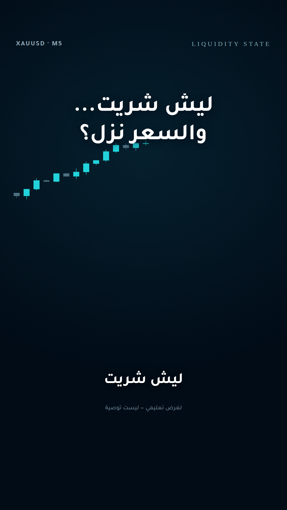
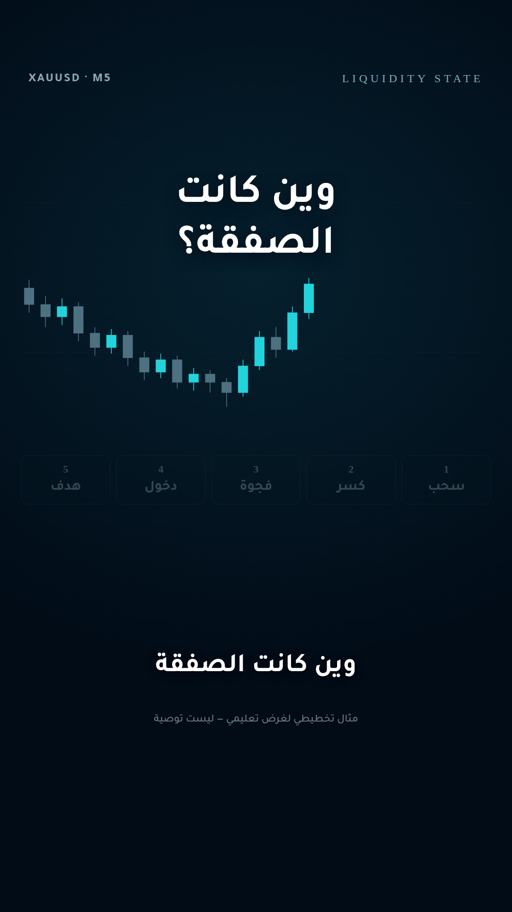
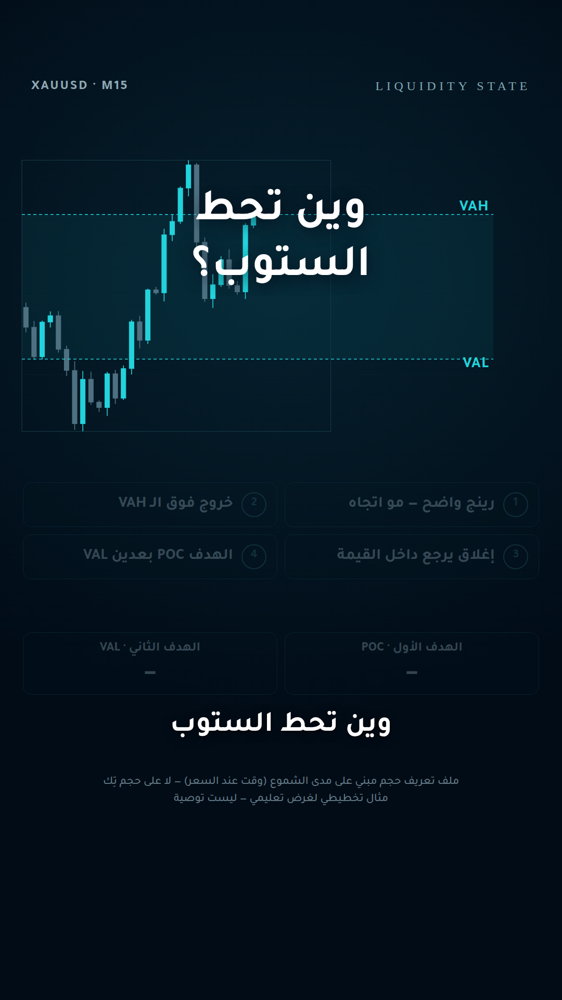
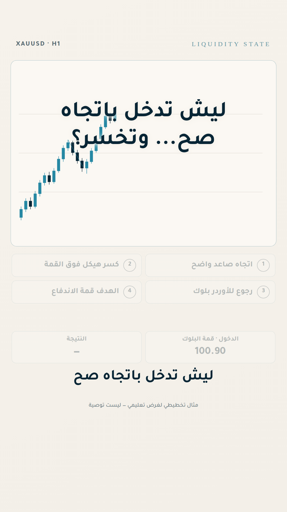
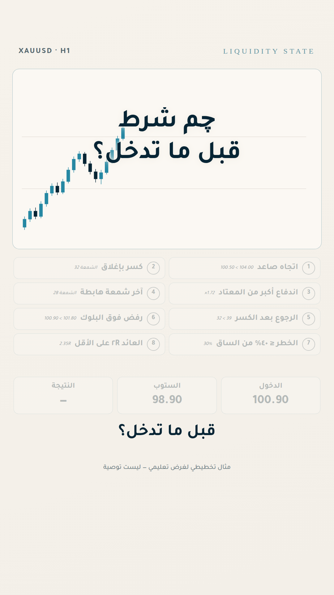
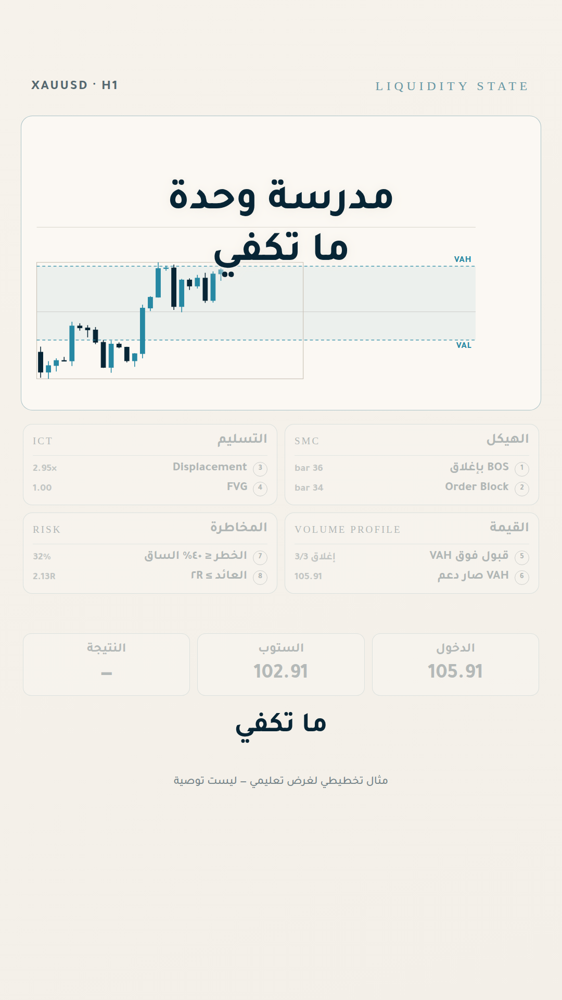
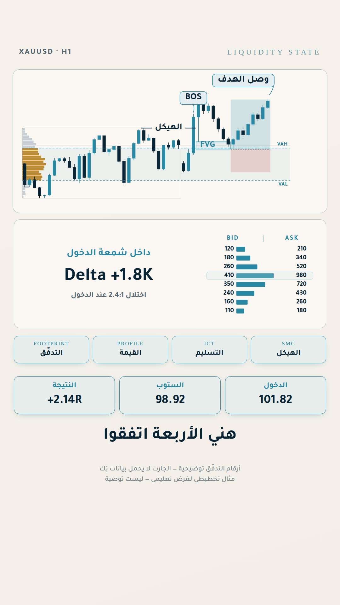
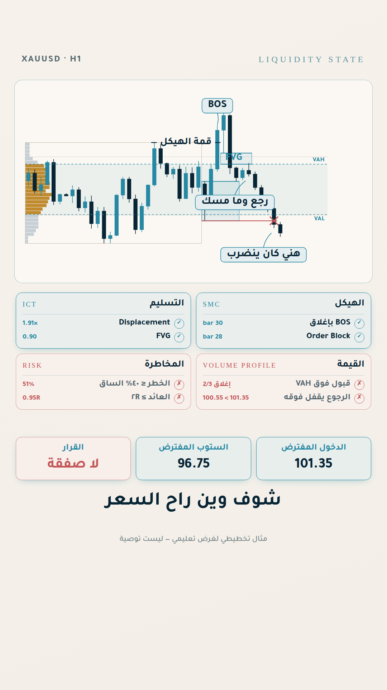
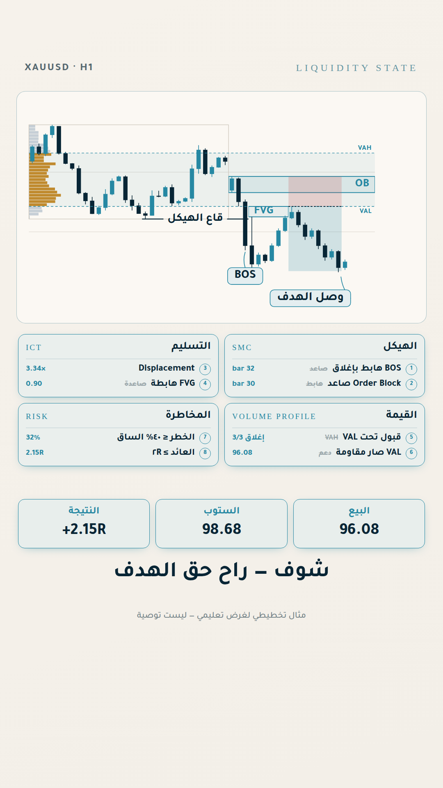
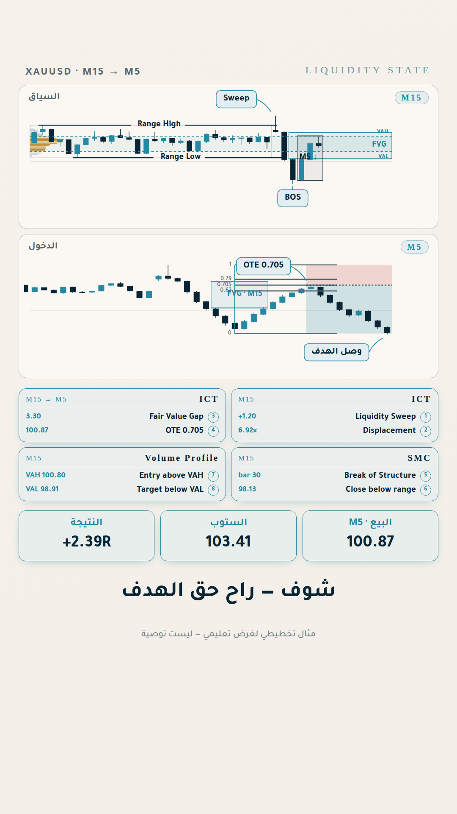
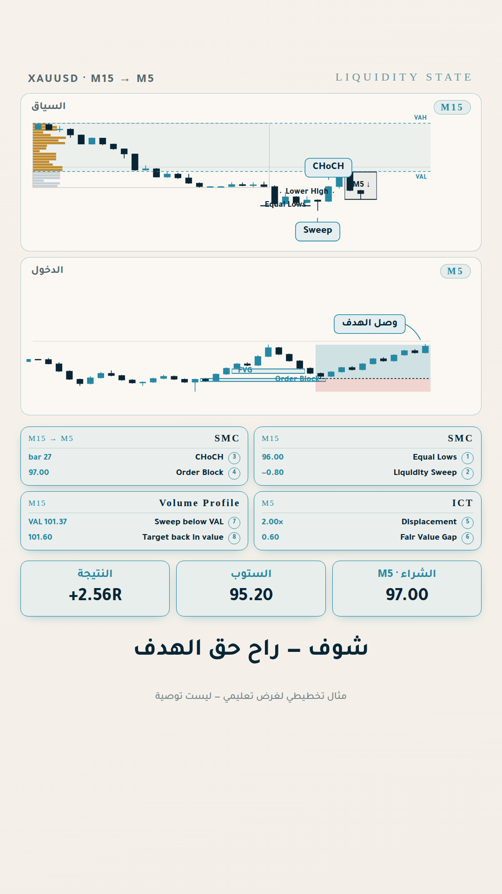
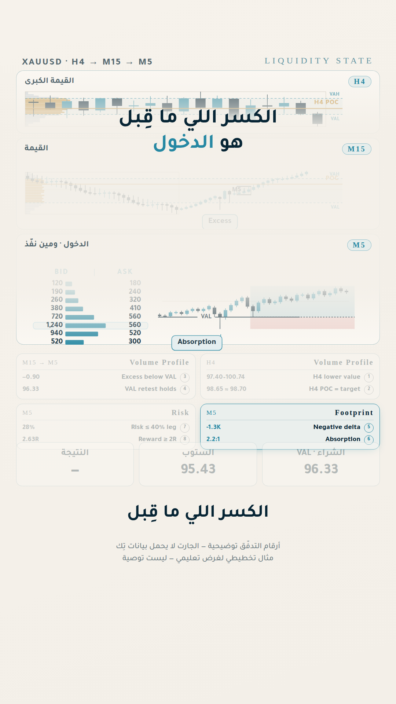
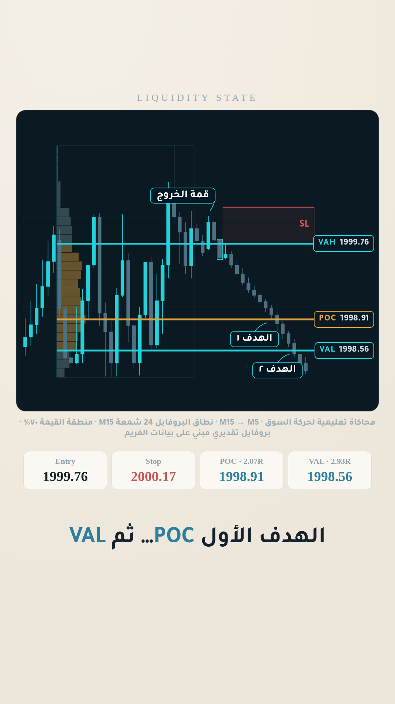

The three multi-frame reels are standalone — no series, no callbacks — and each
leads with a different school, named in English on the cards: **ICT**
(liquidity sweep, displacement, fair value gap, OTE 0.705), **SMC** (equal
lows, sweep, CHoCH, order block, mitigation), and **Volume Profile +
Footprint** (excess below VAL, acceptance, POC as target, negative delta,
absorption). The three cards answer *with whom*, *where* and *when* in turn: on
M15 the whole entry is one wick, and the level the trade turns on is passed to
every chart that shows it as the same variable rather than re-derived. Each H4
card carries its own tie to the entry — the M15 sweep landing inside the H4
order block, the equal lows sitting inside H4 demand, the M15 target being the
H4 point of control. `reel-value-poc.html` puts the footprint ladder beside the
M5 candles in the same card — the chart says where, the ladder says who.

`reel-stop-vp.html` is the exception in this group and says so on its own
face: two frames, not three, and the chart is 992×820 — the whole card — with
the M5 **replacing** the M15 for the confirmation beat rather than sitting
beside it. It is also the first page rendered under `CHART_SOURCE_MODE`, a
three-step preference: the original chart, else a rebuild from verified market
data, else a labelled educational simulation. Both intraday data routes on this
account are behind a paid tier, so it is a simulation — and the chart carries
the words, the range the profile was measured over, and the fact that the
volume is a time-at-price approximation derived from the candles. Two rules
bend there for measurable reasons, both written up in `reel-stop-vp.md`: a
value-area edge is drawn where the distribution puts it rather than snapped to
a wick tip, and the level names live in the price gutter instead of inside the
line, because an inline label on a chart that dense lands on the candles.

One trap the H4 layer introduces: searching the whole context for "the biggest
impulse" finds a lucky run of drift instead of the real one, and every
condition downstream then passes on a level the market never launched from.
The search is restricted to the recent H4 candles for that reason.

Building these surfaced two engine bugs that only appear with more than one chart
on a page, both now fixed in `markup.js`: SVG ids were counted per chart instance
though they are document-global, so the second chart's clip-paths resolved to
the first chart's and its reveals painted nothing; and sticker boxes were
clamped to the plot rather than to the series, so on a panning chart a
mid-series sticker was pinned past the right edge and then carried off-screen.

`reel-orderflow.html` is part seven, and the answer to the question part six ended on. Three
schools live on the chart; the fourth gets a **footprint ladder card** of its own below it. The
rows are stated on the page as illustrative — delta and imbalance are not in OHLC — but every
number derived from them is real: the delta is summed from the rows (**+1810**), the lit row is
genuinely the heaviest, the imbalance is a computed ratio (**2.39**), and the heaviest row sits
at the entry price, which is the condition the school is being asked about. The FVG floor, the
VAH and the entry are one number, **101.82**. See [`reel-orderflow.md`](reel-orderflow.md).

`reel-no-trade.html` is part eight, and the one the account owed its audience: every reel before
it ended with all the boxes lit. This one asks the **same eight questions** and gets two schools
yes, two no — the break never earned acceptance above the VAH (2/3 closes), the pullback closed
back inside value (100.55 < 101.35), the structural stop is 51% of the leg, and the return would
have been 0.95R. Nothing is staged to fail: the candles are written first and then interrogated.
It introduces a third tile state, `.school.no` — **refuted** in the invalidation red, carrying
the number it failed on, because dim-and-silent already means "not checked yet". The proof is
that the stop would have been hit on bar 39 and the target never reached, verified by scanning
the candles independently of the drawing code. See [`reel-no-trade.md`](reel-no-trade.md).

`reel-sell-edge.html` is part nine: the whole gate mirrored onto a short, with each condition
carrying the buy-side word it replaces, struck through beside it — VAL for VAH, resistance for
support, a bullish order block, the stop above. The claim has the same shape as part six's and
is just as literal: the **ceiling** of the bearish ICT gap, the low edge of the value area, and
the sell are all **96.08**. +2.15R, stop never touched. See [`reel-sell-edge.md`](reel-sell-edge.md).

`reel-confluence.html` is part six: the same eight-condition gate, but grouped by the school
that owns each pair, and six of the eight carry that school's name — BOS and Order Block (SMC),
Displacement and FVG (ICT), acceptance above VAH and VAH-as-support (Volume Profile), with risk
size and R as the fourth card. A card lights only when **both** of its conditions hold; one
school agreeing with itself is not confluence.

The value area is measured from the range bars first, and the trade's candles are then written
against the measured VAH — so the claim on screen is literally true rather than nearly true:
the floor of the ICT gap, the top of the value area, and the entry are all **105.91**, one
number. Footprint is deliberately absent: delta and imbalance cannot be derived from OHLC, and
that limit is handed to the closing question instead of being papered over.

`reel-entry-gate.html` is part five: the same order-block trade, but the subject is the **eight
conditions** it has to pass rather than the pattern. Each condition is evaluated in code against
the candles — displacement is the breaking candle's body over the mean of the previous ten
(1.72×), risk is the block's height over the leg it produced (30%), and so on — so a tile only
lights when the chart has actually satisfied it, and each carries the number it passed on.
Four of the eight are the ones everyone already looks at; the other four are what the reel is
for. See [`reel-entry-gate.md`](reel-entry-gate.md).

The split-screen format runs **two clocks**: captions change every ~0.6s while the chart changes
every ~3.5s — roughly six captions per chart beat. Uses the `terminal` dark theme.


---

## 7. Carousel + footprint

The carousel format is documented in full — page architecture, type scale, component set, the
footprint method, and a page-by-page recipe — in **[`FORMAT-CAROUSEL.md`](FORMAT-CAROUSEL.md)**.
`carousel-demo.html` is the working template: seven pages at 1080×1350, copy it and swap the
content.

Every page is the same seven bands in the same order — counter · crest · headline · sub ·
content · conclusion · (cta) — and the furniture is stamped in by script rather than re-typed
per page. Page 1 is the only dark page (`data-ls-theme="cover"`); the rest are the cream
identity.

`footprint.js` renders order flow in four variants: `ladder` (the hero panel), `heat` (bid |
candle | ask), `inside` (the grid laid over the candle body) and `bars` (proportional bid /
price / ask). One rule governs all of them:

> **The ladder is always LTR — bid left, ask right**, even on an RTL page. It is a market
> convention, not text. Arabic labels sit outside the ladder and stay RTL.

Render and check a deck with:

```bash
python3 capture-slides.py carousel-demo.html carousel/
# violations: 0   corrections: 0
```

It exits non-zero if any chart on any page broke its own accuracy rules, so a deck can't be
shipped looking finished while a level runs past the candle that killed it.

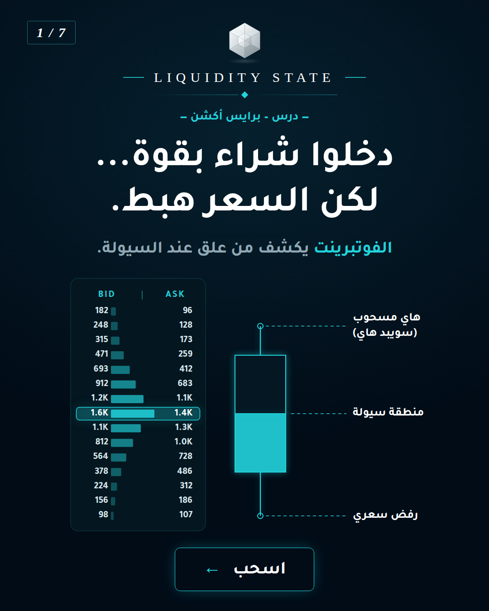

---

## 8. Rules

- Never pure black (`#000000`) or pure white (`#FFFFFF`) backgrounds. Never neon.
- Max 2 font sizes per slide besides labels; one big hook line per screen.
- Charts are always brand-styled — never raw TradingView screenshots with default colors.
- Red `#DC4B41` is reserved for invalidation / stop only.
- Every educational post carries a comment keyword CTA.

---

## Notes

- The logo SVGs are a faithful **vector recreation** of the supplied reference artwork, built to the
  brand palette — very close, but not a pixel-for-pixel copy. If you have the original master file
  (PNG/AI/vector), drop it into `logo/` as `liquidity-state-logo-original.*` to keep it as the
  archival source.
- The hex values in `colors.json` are **visually matched** from the approved carousel design.
  If you have the original design source (HTML/Figma/PSD), share it and the values can be made exact.
- Full brand system beyond visuals (voice, pillars, formats, audience): see the
  `liquidity-state-brand` skill.
