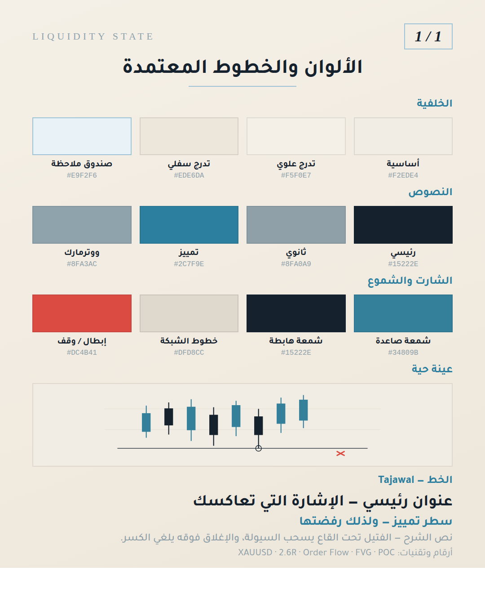
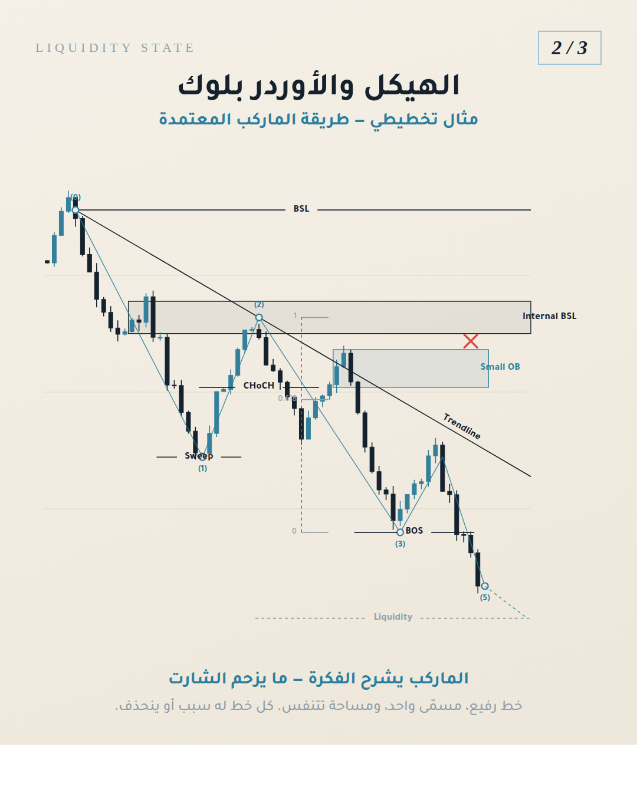

# Liquidity State — Brand Identity Assets

Canonical brand identity for **@liquidity.state**: logo, approved color palette, typography,
and ready-to-use design tokens.

```
assets/brand/
├── colors.json            ← design tokens (source of truth for color + type)
├── brand.css              ← CSS variables + slide/chart/markup primitives
├── MARKUP.md              ← the approved chart markup method (read before marking up a chart)
├── markup.js              ← markup engine: levels, zones, structure, fib, projection
├── markup-demo.html/.png  ← worked example of the full markup vocabulary
├── palette-swatches.html  ← swatch sheet source
├── palette-swatches.png   ← swatch sheet render (1080×1350)
├── fonts/                 ← vendored Tajawal (OFL) for reproducible renders
└── logo/                  ← logo lockups + gem mark (SVG + PNG)
```

---

## 1. Logo

| File | Use |
|---|---|
| `logo/liquidity-state-logo-light.svg` / `.png` | Primary lockup on light / cream backgrounds |
| `logo/liquidity-state-logo-dark.svg` / `.png` | Primary lockup on the dark-teal background |
| `logo/liquidity-state-mark.svg` / `.png` | Gem mark only, transparent — watermark, profile icon, favicon |

SVGs are the source of truth. PNGs are exported at 2400 px wide (mark at 1200 px).

**Mark:** faceted silver / steel gem. Keep it small — bottom-corner or top-corner watermark, never dominating.
**Clear space:** at least the height of the gem on all sides. **Minimum mark size:** 40 px.
Do not recolor the gem, stretch the lockup, or place the light lockup on busy / low-contrast photos.

---

## 2. Approved palette — light (cream) theme

This is the **approved primary design theme**, taken from the carousel design system
(slide "الإشارة التي تعاكسك"). Use it for carousels, charts and static posts.

| Role | Hex | Usage |
|---|---|---|
| Background — base | `#F2EDE4` | Slide canvas (warm cream) |
| Background — gradient start | `#F5F0E7` | Top-left of canvas gradient |
| Background — gradient end | `#EDE6DA` | Bottom-right of canvas gradient |
| Surface | `#E9F2F6` | Badge / callout box fill |
| Surface border | `#9EC4D5` | Badge / callout box + counter border |
| Text primary | `#15222E` | Headlines, sub-headlines, key stat lines |
| Text secondary | `#8FA0A9` | Body and closing explanation lines |
| Text accent | `#2C7F9E` | Highlight sentence, section labels |
| Watermark | `#8FA3AC` | Corner `LIQUIDITY STATE` wordmark |
| Candle — bullish | `#34809B` | Up candle body + wick (teal) |
| Candle — bearish | `#15222E` | Down candle body + wick (deep navy) |
| Structure | `#15222E` | Level lines, equal-lows, markers, circles |
| Gridline | `#DFD8CC` | Horizontal chart grid |
| Invalidation | `#DC4B41` | Stop / rejection mark (✗) — **reserved, never decorative** |

### Alternate — dark theme (reels / video overlays)

Background `#0E1E24`→`#12262E`, surface `#1B3A45`, text `#FFFFFF` / `#9FB4BC`,
bullish `#2ECC9A`, bearish `#E15A5A`. Activate with `data-ls-theme="dark"`.

### Metallic (logo mark only)

Silver/steel gradient: `#FFFFFF` → `#E6ECEF` → `#CDD6DA` → `#A9B4BA` → `#7E8A90`, edges `#BFC9CE`.



---

## 3. Typography

- **Arabic — Tajawal** (vendored in `fonts/`, OFL licensed).
  Bold 700 for headlines / sub-headlines / accent lines, Medium 500 for body, Regular 400 for captions.
- **Latin wordmark — Cormorant Garamond** (fallback Trajan Pro / Times New Roman), uppercase,
  letter-spacing `0.28em`. Used for the logo and the corner watermark. Italic for slide counters (`2/3`).
- **Technical terms & numbers** — Tajawal, Western digits (`XAUUSD`, `2.6R`, `Order Flow`, `FVG`, `POC`).

Type scale at a 1080×1350 canvas: headline 64 / sub-headline 40 / accent 34 / body 30 / caption 24 / watermark 22.

> **Arabic rendering:** always apply the `arabic-video-text` skill before rasterizing Arabic.
> Browsers and libass shape correctly from raw text; PIL, node-canvas and ffmpeg `drawtext` need
> reshaping + bidi first. The swatch sheet is rendered through Chromium for this reason.

---

## 4. Using the tokens

```html
<link rel="stylesheet" href="assets/brand/brand.css">

<div class="ls-slide">                     <!-- 1080×1350, cream gradient, RTL, Tajawal -->
  <div class="ls-badge">مثال تخطيطي</div>
  <h1 class="ls-headline">الإشارة التي تعاكسك</h1>
  <p class="ls-accent">هني الإشارة اللي تعاكسك — ولذلك رفضتها</p>
  <p class="ls-body">الفتيل تحت القاع يسحب السيولة، والإغلاق فوقه يلغي الكسر.</p>
</div>
```

Chart primitives: `.ls-candle-up`, `.ls-candle-down`, `.ls-level`, `.ls-grid`, `.ls-invalid`.
UI primitives: `.ls-badge`, `.ls-counter`, `.ls-pager` (`i.on` = active), `.ls-watermark`.

Render a slide to PNG:

```bash
/opt/pw-browsers/chromium-1194/chrome-linux/chrome --headless --no-sandbox --disable-gpu \
  --hide-scrollbars --allow-file-access-from-files --window-size=1080,1350 \
  --screenshot=out.png "file://$PWD/slide.html"
```

---

## 5. Chart markup

Structure lines, order blocks and explanation lines follow one approved method — hairlines with
labels set inside a break in the line, outlined zones, a single structure zigzag with swing tags,
and diagonals labelled along their own angle.

**Read `MARKUP.md` before marking up any chart.** Engine: `markup.js`. Worked example:
`markup-demo.html` → `markup-demo.png`.



---

## 6. Rules

- Never pure black (`#000000`) or pure white (`#FFFFFF`) backgrounds. Never neon.
- Max 2 font sizes per slide besides labels; one big hook line per screen.
- Charts are always brand-styled — never raw TradingView screenshots with default colors.
- Red `#DC4B41` is reserved for invalidation / stop only.
- Every educational post carries a comment keyword CTA.

---

## Notes

- The logo SVGs are a faithful **vector recreation** of the supplied reference artwork, built to the
  brand palette — very close, but not a pixel-for-pixel copy. If you have the original master file
  (PNG/AI/vector), drop it into `logo/` as `liquidity-state-logo-original.*` to keep it as the
  archival source.
- The hex values in `colors.json` are **visually matched** from the approved carousel design.
  If you have the original design source (HTML/Figma/PSD), share it and the values can be made exact.
- Full brand system beyond visuals (voice, pillars, formats, audience): see the
  `liquidity-state-brand` skill.
