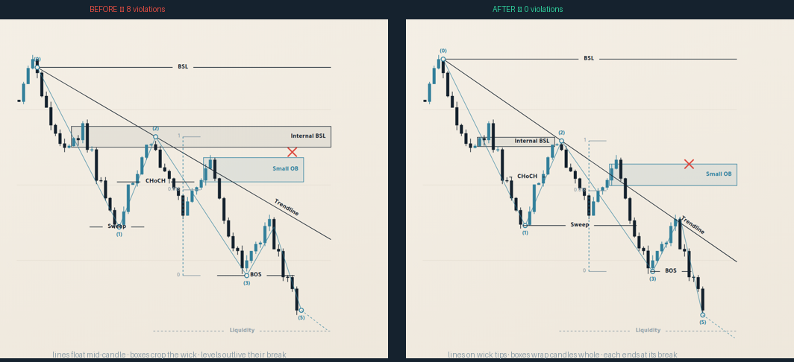

# trading-bridge — documentation

English documentation for this repository.

- [Chart Drawing Accuracy skill](#chart-drawing-accuracy) — validates that lines and boxes on a
  candlestick chart are geometrically honest
- [Brand assets](#brand-assets) — logo, palette, chart markup engine, reel formats

---

# Chart Drawing Accuracy

A Claude skill that checks every line, level, and box drawn on a candlestick chart against the
actual candles, and reports each one that is drawn wrong.

**Location:** `.claude/skills/chart-drawing-accuracy/`

Most bad trading charts are not wrong about the *idea* — they are wrong about **where the drawing
starts and where it stops**. A level extended past the candle that broke it asserts that the level
held, while the candles behind it say it did not. This skill turns that from a matter of opinion
into something a script can decide.



## The rules it enforces

**1. A drawing is anchored to the candle that created it — exactly.**

| | |
|---|---|
| A line sits on a **wick tip** | A level is the high or the low of a specific candle. Drawn mid-candle it marks a price the candle merely passed through — and a candle passes through every price in its range, so the line says nothing in particular. |
| A box wraps its candle **whole, wick to wick** | Cropped to the body it hides the wick, and the wick is the part that did the sweeping. An order block excluding its own wick makes price look like it missed a zone it actually traded into. |

**2. A drawing ends on the candle that broke it.** Once price trades through a level or back into a
zone, that drawing's life is over.

**Before anything counts as a break, price has to leave first.** A level is born touching price, so
the bar right after a swing high is usually still at that high — that is not a break, that is price
not having left yet. Nothing is treated as a break until price has departed the drawing at least
once. Without this, every drawing reads as broken one bar after it was created.

## Install / verify

The skill is committed in this repository under `.claude/skills/`, so it is active for any Claude
session opened here — nothing to install. The checker is pure Python 3 standard library, no
dependencies.

Verify it works:

```bash
python3 .claude/skills/chart-drawing-accuracy/scripts/verify_drawing.py --selftest
```

```
  [ok  ] BSL            expected edge, got edge
  [ok  ] Internal BSL   expected partial, got partial
  …
all 8 checks pass; the skill is installed and working.
```

To use it outside this repository, either copy the `chart-drawing-accuracy/` directory into
`~/.claude/skills/`, or install the packaged bundle at
[`dist/chart-drawing-accuracy.skill`](../dist/chart-drawing-accuracy.skill).

## Usage

Claude invokes it automatically when a chart is being marked up, reviewed, or prepared for
publishing — including on Arabic prompts (`دقة الرسم`, `الخط يمتد بعد الكسر`, `راجع الشارت`).
You can also run the checker directly.

### 1. Describe the chart

```json
{
  "candles": [
    {"o": 95.0, "h": 96.4, "l": 94.1, "c": 96.0},
    {"o": 96.0, "h": 101.2, "l": 95.8, "c": 100.4}
  ],
  "drawings": [
    {"id": "BSL",      "kind": "level",      "price": 101.2, "from": 1},
    {"id": "Small OB", "kind": "zone",       "top": 86.07, "bottom": 82.97, "from": 41},
    {"id": "BOS",      "kind": "level",      "price": 70.59, "from": 50, "mode": "close"},
    {"id": "TP",       "kind": "target",     "price": 62, "from": 30},
    {"id": "path",     "kind": "projection", "from": 61, "to": 68}
  ]
}
```

The candle array is abbreviated above — it needs one entry per bar, and every `from`/`to` must be a
real index into it. Candle index 0 is the oldest. `from` is the anchor bar; `to` is the last bar the
drawing covers (omit it to mean "runs to the right edge"). A complete, runnable spec ships with the
skill at `examples/demo-spec.json`.

### 2. Run it

```bash
SKILL=.claude/skills/chart-drawing-accuracy

python3 $SKILL/scripts/verify_drawing.py spec.json                    # report
python3 $SKILL/scripts/verify_drawing.py spec.json --json             # machine-readable
python3 $SKILL/scripts/verify_drawing.py spec.json --fix out.json     # correct endpoints
python3 $SKILL/scripts/verify_drawing.py spec.json --fix out.json --snap   # also fix geometry
```

Exit code is `0` when every drawing is accurate and `1` when anything is off, so it works as a
pre-publish gate in CI or a git hook.

### 3. Read the findings

```
[LONG] Small OB   ends at bar 62 but bar 42 already broke it (touch); it is drawn 20 bars too long  → to: 42
[EDGE] BSL        sits mid-candle at 100; bar 4 runs 98.44–101.2, so the level is 101.2
[ANCH] BOS        bar 44 never reaches 70, so the line starts from a candle that did not make that level
[ok  ] Sweep      ends exactly at the breaking bar 46
```

| Status | Meaning | Fix priority |
|---|---|---|
| `ANCH` | anchored to a candle that never traded at that price | **first** — a wrong anchor makes the break analysis meaningless |
| `LONG` | extends past the candle that broke it | the headline error |
| `EDGE` | a level floating mid-candle instead of on a wick tip | `--snap` |
| `PART` | a box cropping its candle instead of wrapping it | `--snap` |
| `SHRT` | stops before price actually broke it | understates a level that was still working |
| `FLOAT` | runs to the edge but price never returned to it | mark it a target, or drop it |
| `BAD` | index out of range, inverted box | structural bug |

### Options per drawing

| Option | Default | Effect |
|---|---|---|
| `mode` | `touch` | what breaks it: `touch` (a wick reaches it), `close` (a candle closes beyond it), `fill` (a candle fully traverses the zone) |
| `side` | `auto` | levels: which direction breaks it, inferred from the anchor candle |
| `tolerance` | `0` | price slack — set roughly one tick |
| `edge` | `true` | levels: must sit on a wick tip |
| `whole` | `true` | zones: must wrap the candle entirely |
| `spanBars` | `1` | zones: how many candles the box wraps |

Use `mode` deliberately. Claiming a structural break on a wick and then drawing it as though a
close confirmed it is the most common way a chart overstates its case.

### Tolerance

A level is almost never at a candle's exact float extreme — it is drawn at a round price a human
chose. At zero tolerance a level at `77.21` fails against a candle whose low is `77.21364…`:
technically true, practically useless, and it buries the real findings in noise. Set `tolerance` to
about one tick of the instrument, or ~0.1% of the visible range.

### Targets are the one exception

A level marking price that has not happened yet — untapped liquidity, a take-profit — has no anchor
candle and cannot be broken, so it is exempt from every rule. It only has to stay untouched: the
moment price trades there it becomes an ordinary level and the full rules apply. Mark it
`"kind": "target"` and draw it dashed, so the chart itself separates *this happened* from
*this might*.

## Reading a chart from an image

When the source is a screenshot rather than data, extract the candle values first (the
`tradingview-chart-reading` protocol), then build the spec. Do not eyeball whether a line stops in
the right place — the failure mode this skill exists to catch is that wrong drawings *look* fine.
If candle values cannot be recovered, say the check could not be run rather than implying the chart
was verified.

---

# Brand assets

`assets/brand/` holds the visual identity and the chart tooling. See
[`assets/brand/README.md`](../assets/brand/README.md) for the full system; the parts relevant to
this skill:

| File | Purpose |
|---|---|
| `markup.js` | chart markup engine — levels, zones, structure, volume profile, position tool |
| `MARKUP.md` | the approved markup method and its drawing rhythm |
| `tools/check-rules-parity.js` | proves the JS and Python rule implementations agree |

## Enforcing the rules while drawing

The engine applies the same rules as it draws, so endpoints and geometry never have to be
maintained by hand:

```js
const ch = LSChart({
  mount: '#chart', candles,
  autoTerminate: true,   // each level/box ends at the candle that broke it
  snapToCandle: true,    // levels land on wick tips, boxes wrap candles whole
  tolerance: 0.05
});

ch.zone({ from: 41, top: 87, bottom: 83.5, label: 'Small OB' });   // ends itself
ch.level({ price: 77.2, label: 'Sweep', from: 22 });               // snaps to the wick
ch.level({ price: 62, label: 'Liquidity', from: 30, target: true });  // exempt
ch.layout();

ch.violations;    // anchors that don't hold up — reported, never auto-moved
ch.corrections;   // everything snapToCandle changed, with old value and reason
```

`to` accepts a number (you assert the endpoint), `'auto'` (always terminate at the break),
`'edge'` (run to the right edge), or nothing (terminates when `autoTerminate` is on). A drawing
that is never broken runs to the edge, because it is still live.

Snapping rewrites your numbers, so it logs every change to `ch.corrections` rather than doing it
silently. Anchors are only *reported*: which candle you meant is a judgement call, not arithmetic.

## Keeping the two implementations honest

The rules exist twice — in `markup.js` while drawing, and in `verify_drawing.py` standalone. Two
implementations of one rule set drift, so a parity check runs both over the same spec and fails on
any disagreement:

```bash
node assets/brand/tools/check-rules-parity.js
```

Run it after touching either implementation.
